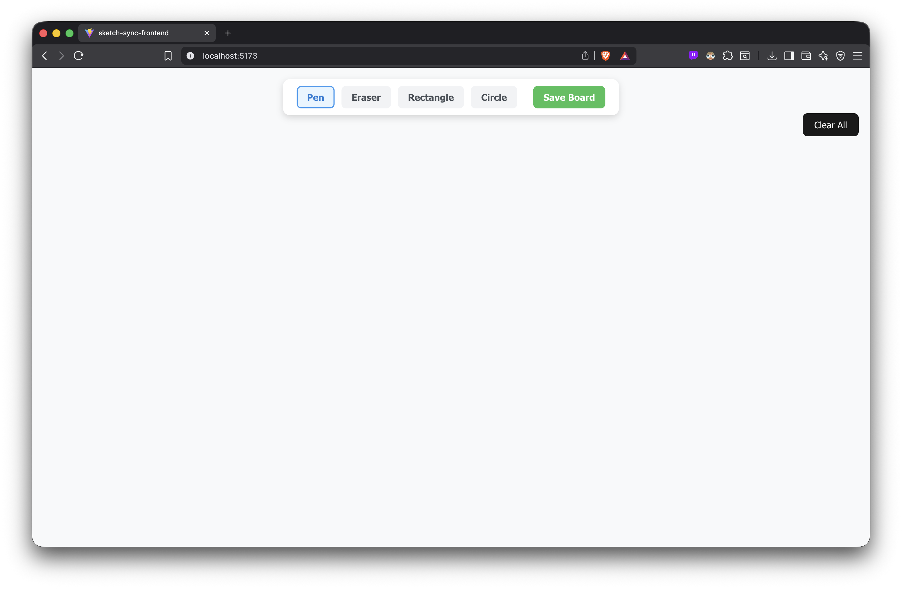

# Sketch-Sync: Real-time Collaborative Whiteboarding

**Sketch-Sync** is a high-performance, real-time collaborative drawing application. It provides a familiar, hand-drawn aesthetic paired with a robust Spring Boot engine designed for seamless multi-user interaction and instant synchronization.

---

<p align="center">
  
</p>

---

## 🚀 Overview

Sketch-Sync allows users to brainstorm, diagram, and doodle together in a shared digital space. By leveraging modern web technologies, it ensures that every stroke made by one user is visible to all others with near-zero latency.

### Core Statement

> "Sketch-Sync bridges the gap between individual creativity and team collaboration, providing a flexible, intuitive digital canvas backed by enterprise-grade synchronization."

---

## 🛠 Tech Stack

The architecture is split into a reactive frontend and a scalable backend to handle high-frequency data updates.

- **Frontend:** React (State management, HTML5 Canvas API)
- **Backend:** Spring Boot (Java)
- **Communication:** WebSockets (STOMP/SockJS) for bi-directional, real-time data flow.

---

## 🏗 System Architecture

To maintain a consistent state across all clients, Sketch-Sync utilizes a "Pub-Sub" (Publisher-Subscriber) model over WebSockets.

1.  **Client-Side:** The React frontend captures mouse/stylus coordinates and draws them locally for instant feedback.
2.  **The Sync:** These coordinates are wrapped in a JSON payload and sent via a WebSocket message.
3.  **Server-Side:** The Spring Boot backend receives the message and broadcasts it to all other "subscribed" users in the same session.
4.  **Update:** Other clients receive the payload and render the new strokes on their respective canvases.

---

## ✨ Features

- **Real-time Collaboration:** Multiple users can draw simultaneously without overwriting each other.
- **Drawing Tools:** Fully functional **Pen**, **Rectangle**, and **Circle** tools for diverse diagramming.
- **Eraser & Clear All:** Quickly modify your work or reset the entire canvas.
- **Save Board:** Persist your creative sessions to the backend.
- **Responsive Canvas:** Works across different screen sizes while maintaining coordinate accuracy.

---

## 🛠 Installation & Setup

### Prerequisites

- JDK 17 or higher
- Node.js (v18+)
- Maven

### Backend (Spring Boot)

```bash
cd backend
mvn clean install
mvn spring-boot:run
```
